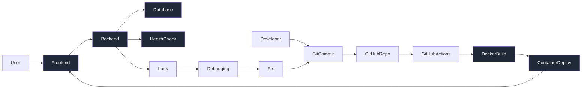

<h1 align="center">Ritika Garg</h1>

DevOps Engineer | AWS | Docker | Kubernetes | CI/CD | Infrastructure Reliability

  

  

---

## 👩‍💻 About Me

DevOps Engineer with 2.5 years of experience working on containerized deployments, CI/CD automation, and AWS infrastructure.

I focus on:

- Building reliable containerized systems  
- Automating build and deployment pipelines  
- Debugging runtime container failures  
- Understanding system behavior under stress  
- Strengthening Kubernetes and infrastructure fundamentals  

DevOps is not about tools — it is about system behavior and reliability.

---

# 🚀 DevOps Task Manager – Unified System Flow

This flow represents:

- Multi-service container architecture  
- Automated CI pipeline triggered on push  
- Docker image build and deployment lifecycle  
- Health monitoring endpoint  
- Log-based runtime debugging  
- Continuous improvement through feedback loop  

---

# 🛠 Technical Stack

### ☁️ Cloud  

### 🐳 Containers & Orchestration  
  

### 🔁 CI/CD  
  

### 🏗 Infrastructure as Code  

### 🖥 OS & Scripting  
  
  

---

# 📈 GitHub Activity

  
  

---

# 🔥 Currently Strengthening

- Kubernetes CrashLoopBackOff root cause analysis  
- Container networking fundamentals  
- Resource limits & cgroup behavior  
- Terraform state management  
- Observability and system monitoring  

---

# 📫 Connect With Me

LinkedIn:  
https://www.linkedin.com/in/ritika-garg-b39270194/

Email:  
ritikagarg60814@gmail.com  

---

> DevOps maturity begins when you understand failures, not just deployments.
